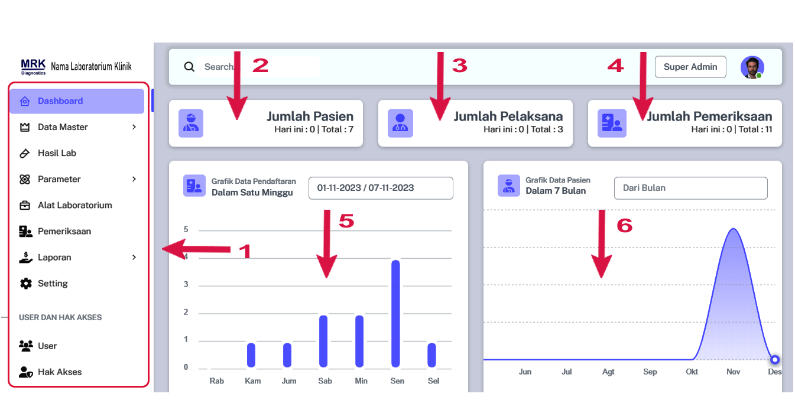

# Dashboard Aplikasi

## Step 2 - Dashboard Aplikasi iQLab LIS

<figure><figcaption></figcaption></figure>

1. Menu Panel bebrapa modul
2. Jumlah Pasien yang terdaftar pada hari ini / Jumlah pasien secara keseluruhan.
3. Jumlah Pelaksana yang terdaftar hari ini / Tolat pelaksana
4. Jumlah Pemeriksaan yang terdaftar pada hari ini / Jumlah pasien secara keseluruhan.
5. Grafik Pasien dalam satu minggu dan juga dapat dilihat menurut filter tanggal yang diinginkan.
6. Grafik Pasien dalam bebrapa bulan dan juga dapat dilihat menurut filter tanggal yang diinginkan.
