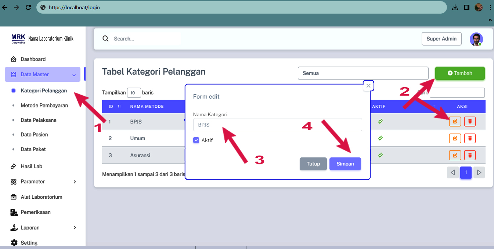

# Kategori Pelanggan

### Cara menambahkan Kategori pelanggan

<figure><figcaption>
Tabel Kategori Pelanggan
</figcaption></figure>

1. Pada Menu list Data Master Pilih Data Pelanggan
2. Anda bisa menambah atau mengedit&#x20;
3. Masukan Jenis Pelanggan
4. Simpan
