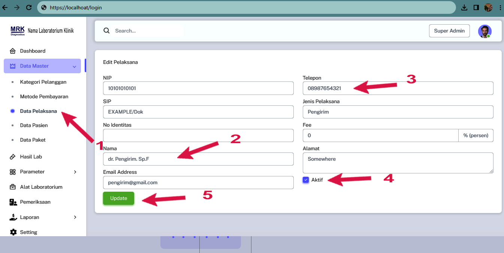

# Data Pelaksana

### Cara menambahkan Data Pelaksana

<figure><figcaption>
Daftar Data Pelaksana
</figcaption></figure>

1. Pada Menu list Data Master Pilih Data Pelaksana
2. Anda bisa menambah atau mengedit&#x20;
3. Masukan Jenis Pelaksana
4. Jangan lupa klik ceklist aktif untuk mengaktifkan dan Non-aktifkan
5. Simpan
