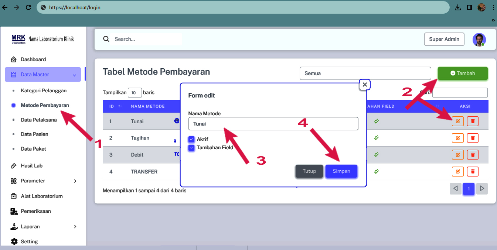

# Metode Pembayaran

### Cara menambahkan Metode Pembayaran

<figure><figcaption>
Daftar Metode Pembayaran
</figcaption></figure>

1. Pada Menu list Data Master Pilih Data Pelanggan
2. Anda bisa menambah atau mengedit&#x20;
3. Masukan Jenis Metode Pembayaran
4. Simpan
